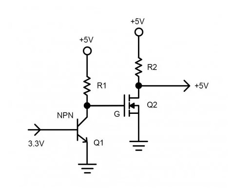
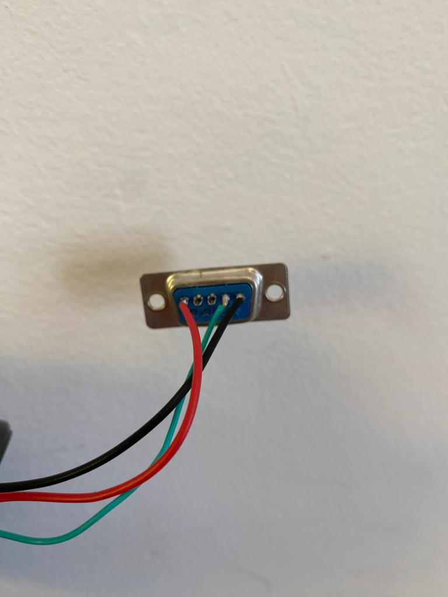
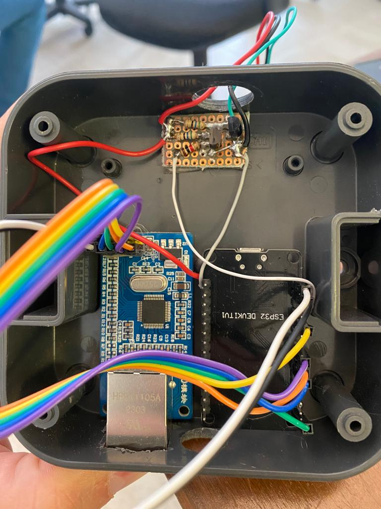

### 🔍 Overview
Esse examplo demonstra um uso basico de `Ethernet driver` junto com `tcpip_adapter`. Os funcionamento global segue:
1. Instalação do driver Ethernet.
2. Envio de requerimento DHCP e aguardo da concessão.
3. Aguardo da obtenção de endereço IP.
4. Inicializa cliente MQTT/MQTTS.
5. Após o cliente MQTT/MQTTS ser inicializado, é possível se inscrever e publicar em tópicos.
6. Iniciar o controlador bluetooth low energy (BLE).
7. Iniciar um serviço Nordick.

### 💻 Pré-Requisitos
Para esse projeto, é necessário ter:
-ESP32.
-Módulo Ethernet W5500. O módulo pode necessitar de uma fonte externa de alimentação. 3,3V, corrente superior a 200mA. 
-Realizar as conexões entre o ESP32 e o módulo. Essas conexões serão detralhas mais à frente.
-Cabo USB para programação
-ESP-IDF instalado na máquina.
-Cabo de rede Rj45.
-Broker MQTT/MQTTS em execução. Em caso de Broker MQTTS, é necessário ter o arquivo do certificado do servidor(CA).
-Level Shifter para converter, em fase, o sinal 3.3V para 5V (TX). Foram confeccionados manualmente usando dois transistores, um resistor de 1K e dois resistores de 10K.




### 🖱️ Componentes
Foram criados alguns componentes, que estão localizados na pasta 'extra_commponents':

`ethe`
Esse componente diz respeito à criação da conexão ethernet, garantindo a conexão de rede. Os valores inicias dos pinos são:
```
SCLK - 18
MOSI - 23
RST  - 21
MISO - 19
CS0  -  5
INT0 -  4
GND  - GND
3.3V   - 3.3V
```
**IMPORTANTE: A ALIMENTAÇÃO DE TODOS OS COMPONENTES DERIVA DO DISPLAY. A ALIMENTAÇÃO DO ESP VEM DO 5V DO DISPLAY, A ALIMENTAÇÃO DO MÓDULO W5500 DEERIVA DO PINO 3.3V DO ESP32.**
```
5V      - VERMELHO
GND     - PRETO
RX UART - VERDE
```





Esses valores devem ser setados através do menuconfig da aplicação. Para isso, entre com 'idf.py menuconfig' no terminal do ESP-IDF. Na aba interativa que aparecer, vá em Example Configuration. Marque a opção 'SPI ETHERNET' e, nas opções abaixo, informe que o Módulo a ser usado será o W5500. No exemplo, foi usado 'SPI clock speed (MHz)=12' e 'PHY Reset GPIO=-1'. Após isso, as configurações iniciais para uso do módulo terminaram.
A TAG do LOGI utilizada é "eth_example". Um manipulador de eventos está setado para verificar a conexão: caso a conexão seja perdida, ela será reestabelecida automaticamente quando possível.
OBSERVAÇÃO IMPORTANTE:
Alguns handles que estão sendo chamados dentro de eth_main.c devem ser invocados somente 1 vez em cada execução da aplicação. É necessário um estudo de quais handles já estão sendo chamados dentro do código em questão para que não haja dupla chamada. Caso isso acontença, o ESP pode apresentar alguns erros na sua execução, como por exemplo, ficar reiniciando.
Para o caso de definição de IP estático, deve-se setar os valores das variáveis constantes estáticas ip, gateway e netmask (de acordo com a rede a ser usada). Caso o IP usado seja o automático, deve-ser comentar as linhas que antecedem a chamada `esp_eth_start(eth_handle_spi)`.
Foi constatado que, após certo tempo sem conexão com a rede, seja por falha na rede ou falha no hardware, como cabo mal conectado e afins, é necessário fazer um reset do módulo W5500. O pino RST do módulo opera em alto e, quando há a intençã de resetá-lo, é necessário setar o pino em baixo por no mínimo 500us e setá-lo novamente eu alto. NO código dessa aplicação, quando o ESP não consegue adquirir um ip automático por 1 minuto e 40 segundos, ele irá resetar o módulo e se alto resetar.

`mqtts`
O componente mqtts pode ser usado tanto para estabelecer conexão com e sem incriptação. À partir do protocolo dessejado, setar o broker definido na variável EXAMPLE_BROKER_URI. No caso de uso de mqtts, o certificado (geralmente chamado de arquivo ca.crt) deve ser inserido na pasta ´certificats´. Nos casos testados, é necessário converter o arquivo para que o mesmo tenha formado .pem. Caso seja esse o caso, rode o comando `openssl x509 -in {mycert.crt} -out broker_ca.pem -outform PEM`, mudando os nomes para o seu arquivo. O nome do arquivo resultante deve ser broker_ca.pem. No exemplo dessa aplicação, há um subscribe automático quando a conexão é estabelecida. Caso não seja necessário, remover a linha de subscribe do gerenciador de eventos `mqq_event_handler`. Também nesse caso de teste, há uma mensagem sendo publicada à cada 1 segundo, sendo chamada no main.c do projeto. O tópico de publish/subscribe é setado em `MQTT_TOPIC`, que deve ser alterado para o seu broker utilizado.
Caso o uso seja sem incriptação, deve-ser remover a linha que define o .pem no mqtt_cfg. Para isso, comentar ou remover a linha `.cert_pem =  (const char *)broker_cert_pem_start`. Caso o broker em questão tenha username e password, deve-se setar seus valores nas variáveis `.username` e `.password`. Caso contrário, pode deixar como uma string em branco ou removê-las.
Esse componente tem como parâmetros prê-setados 3 topicos (char *), sendo um deles para o publish (`arcelor/status`) da mensagem de Status que tem como intuito informar que o sistema está em funcionamento e mantendo a conexão com o broker, outro tópico (`arcelor/rede`) para o envio das configurações de rede que o esp32 irá realizar e o último tópico (`arcelor/message`) para o envio dos dados que devem ser tratados e posteriormente enviados ao display.

`uart`
O componente uart realiza as configurações iniais das portas de envio/recebimento UART, usada para fazer a comunicação com o display. Nesse exemplo, foi setado que a interface UART usada será a UART2, configurando os pinos:
```
UART2_PIN_RX  16
UART2_PIN_TX  17
```
Caso haja necessidade de alterar tais pinos, basta redefini-los nos defines presentes em uart.h. No nosso caso, como é necessário somente envio de informações para o display, nos preocuparemos somente com o pino TX.

`communication`
O componente communication é uma interface de comunicação usada para estabelecer o envio de dados para o display. Esse componente possui diversas funções usadas tanto pelo componente bleuartServer quanto pelo componente mqtts_eth. As mensagens recebida pelo tópico `arecelor/message` será enviada para esse componente e será tratada, gerando as saídas pré-estabelecidas. 

`blemananger` e `bleuartServer`
Esse componentes garantem a possibilidade de conexão bluetooth com o esp32, através de um smarthphone, principalmente. O nome do dispositivo será uma concatenação entre a string `DISPLAY_X`, onde X é o ID do display.

### Mensagens setadas no display
Já estão definidas algumas mensagens padrão para essa aplicação a partir do estado do esp32 e das mensagens recebidas:

**AUTO IP**
Essa mensagem aparece quando a variável não volátil `ip` armazenada na nvs_flash é vazia. Uma vez que essa variável não está vazia, o algoritmo entende que é para ser estabelecida uma conexão ethernet com ip automático.

**IP OK**
Aparece somente para quando é ip automático. Uma vez que a conexão é estabelecida com sucesso e o ip automático é obtido, essa mensagem irá aparecer momentaneamente no display.

**STATIC IP**
Já essa mensagem irá aparecer quando for setado um ip específico (variável `ip` não vazia). Para esse caso, não é possível obter um status da conexão de rede a partir dos dados enviados. Para validar a conexão, basta verificar o tópico de status no broker ou fazer o envio de alguma mensagem válida.

**🔒**
Essa mensagem irá aparecer sempre que não for setada nenhuma mensagem de texto no display ou depois de que uma nova conexão for estabelecida.

**"LAST MESSAGE" e OFF-LINE**
Após o símbolo 🔒 que aparece em toda inicialização, se anteriormente, em algum momento, o ESP32 recebeu alguma mensagem válida e a conexão ethernet ou a conexão com o broker mqtt tenha caído, o display irá exibir essa última mensagem válida por 30 segundos. Após 30 segundos, irá exibir a menssagem `OFF-LINE` por mais 30 segundos. Após esse tempo, ele irá reiniciar e tentar se conectar novamente. Caso não tenha recebido nenhuma mensagem válida, irá aparecer o símbolo do 🔒 e depois, a mensagem de OFF-LIE.

### Definindo IP a partir de uma mensagem MQTT
Após uma conexão de rede ser estabelecida, automaticamente será subscrevido o tópico `arcelor/rede`. O padrão de mensagem a ser enviado é:

```
{
  "id":1,
  "ip":"192.168.15.178",
  "gateway":"192.168.15.1",
  "netmask":"255.255.255.0",
  "dns":"8.8.8.8"
}
```
Através dos valores definidos para esses objetos, será definido os valores da rede (estática) para o display identificado através do objeto `"id"`, dados esses que serão gravados na memória flash, sendo esse o default após qualquer reinicialização.
É possível setar cada parâmetro individualmente, bastando somente enviar o objeto desejado. 
Exemplo:
```
{
  "ip":"192.168.15.178"
}
```

**Objeto "erase"**
Para limpar os valores da memória e definir um ip automático, mandar um json com o objeto ```"erase":1```. Caso esse objeto seja diferente de 0, o restantes da mensagem é ignorada. Esse caso so é possível casa haja conexão internet. Exemplo:
```
{
  "erase":1
}
```

**Objeto "restart"**
Para fazer um reboot no microcontrolador, mandar um json com o objeto ```"restart":1```. Esse caso so é possível casa haja conexão internet. Exemplo:
```
{
  "restart":1
}
```

## IMPORTANTE
**TANTO AS CONFIGURAÇÕES DA REDE QUANTO A DEFINIÇÃO DO ID DO PAINEL QUE POR VENTURA TENHA SIDO MUDADA IRÃO SER APAGADAS.**
**ATÉ O MOMENTO, É SUGERÍVEL ESTABELECER QUAL TIPO DE CONEXÃO (AUTOMÁTICA OU ESTÁTICA) PRIMEIRAMENTE E DEPOIS, REDEFINIR O ID DO PAINEL, CASO NECESSÁRIO**

### Definir ip a partir de uma mensagem bluetooth
Após estabelecer uma conexão bluetooth com o dispositivo, haverá a possibilidade de setar os parâmetros da rede por mensagem pré-definidas.
É possível definir cada parâmetro da rede individualmente ou através de uma única mensagem. A mensagem deve ser enviada em formato de hexadecimal. Também há a possibilidade de realizar um erase nos dados preenchidos na memória flash através de um opcode. O nome do disposito será `DISPLAY_X`, onde X é definido pelo ID do display em questão. 
Há os seguintes opcodes definidos:

**opcode 00**:
Usando esse opcode, é possível definir todos os parâmetros da rede através de uma única mensagem. 
Exemplo:```00C0A80F64C0A80F01FFFFFF0008080808```: após o primeiro hexadecimal informar o valor do opcode, deve inserir imediatamente após ele os valores de ip, gateway, netmask e dns. No caso de exemplo temos que:
`
ip = 00**C0A80F64**C0A80F01FFFFFF0008080808 = 192.168.15.100;
gateway = 00C0A80F64**C0A80F01**FFFFFF0008080808 = 192.168.15.1;
netmask = 00C0A80F64C0A80F01**FFFFFF00**08080808 = 255.255.255.0; 
dns = 00C0A80F64C0A80F01FFFFFF00**08080808** = 8.8.8.8.
` 

**opcode 02**:
Define somente o ip da rede.
Exemplo: ```02C0A80FB2``` = 192.168.15.178

**opcade 03**:
Define o gateway.
Exemplo: ```03C0A80F64``` = 192.168.15.1

**opcode 04**
Define a máscara de rede.
Exemplo: ```04FFFFFF00``` = 255.255.255.0

**opcade 05**
Define o DNS da rede. Usado como o padrão o DNS público do Google, que permite reconhecer o domínio do ambiente QA que utilizamos.
Exemplo: ```08080808``` = 8.8.8.8

**opcode 06**
Realiza um erase na memória flash, limpando todos os parâmetros de rede uma vez setados.
Exemplo: ```06``` = clean flash memory. Após esse comando, será tentada uma conexão de rede com ip automático.

**opcode 07**
Realiza a definição do id do display. Esse id será armazenado na memória interna do esp32 e será definido como padrão após qualquer reinicialização. Para limpar, realizar um erase.
Exemplo: ```0700``` = ao enviar esse comando em HEXA, é definido que o ip do display será 0 (definido através do segundo hexadecimal enviado).

**opcode 08**
Realiza um reboot no ESP32.

**opcode 09**
Esse opcode possui 3 sub-opcodes que definem o URI do broker mqtt, o usuário e a senha desse broker. Para uso de certificado TLS, não há alternativas de configuração usando BLE, sendo necessário adaptar o firmware, como citado na descrição do componente `mqtts`. Para ambos as configurações abaixo, é seguido o seguinte padrão de mensagem, também em hexadecimal: `opcode || sub-opcode || tamanho da mensagem (em caracteres) || mensagem`. Para a conversão do texto para hexadecimal, foi usado um conversor encontrado na web, disponível em: https://onlinestringtools.com/convert-string-to-hexadecimal. A depender da sua interface bluetooth de envio, é necessário retirar os espaços em brancos entre os bytes.
  **sub-opcode 00**:
      Aqui irá ser enviado o URI do broker em que se deseja conectar. Como exemplo, usaremos o broker QA que possuímos. IMPORTANTE: O broker deve ser inicializado com `mqtt://` ou `mqtts://`, em caso de uso com TLS e, após a inserção do domínio ou ip, deve ser inserido `:{porta}`. Exemplo:
      
      Então, após pegar o conteúdo a mensagem em hexadecimal, basta montar o pacote. Note que `mqtt://gwqa.revolog.com.br:1884` possui 31 caracteres e 31 em hexadecimal é 0x1F.
      opcode : **09**001f6d7174743a2f2f677771612e7265766f6c6f672e636f6d2e62723a31383834
      sub-opcode : 09**00**1f6d7174743a2f2f677771612e7265766f6c6f672e636f6d2e62723a31383834
      quantidade de caracteres que serão enviados (em hexa) : 0900**1f**6d7174743a2f2f677771612e7265766f6c6f672e636f6d2e62723a31383834
      mensagem : 09001f**6d7174743a2f2f677771612e7265766f6c6f672e636f6d2e62723a31383834** (mqtt://gwqa.revolog.com.br:1884)

  **sub-opcode 01**
      Aqui será definido o usuário do broker, caso seja exigido. Segue o mesmo padrão de mensagem:
      opcode : **09**010a7465636e6f6c6f676961
      sub-opcode : 09**01**0a7465636e6f6c6f676961
      quantidade de caracteres que serão enviados (em hexa) : 0901**0a**7465636e6f6c6f676961
      mensagem : 09010a**7465636e6f6c6f676961** (tecnologia)
  
  **sub-opcode 02**
      Já aqui, será definido o password do broker.
      opcode : **09**020b3132385061727365637321
      sub-opcode : 09**02**0b3132385061727365637321
      quantidade de caracteres que serão enviados (em hexa) : 0902**0b**3132385061727365637321
      mensagem : 09020b**3132385061727365637321** (padrão complexa)

Esses parâmetros, caso sejam setados através de envio de mensagem bluetooth, seráo armazenados na memória flash e usados a partir de então. Caso seja feito um erase da memória flash, será necessário reconfigurar o microcontrolador com os parâmetros do broker desejado.

### Critérios de Restart da aplicação
Há duas ocasiões em que o microcontrolador irá realizar um reboot. A primeira é quando o microcontrolador não conseguir um IP (válido somente para o caso de IP AUTOMÁTICO) por 1:40 minutos. A segunda é quando o microcontrolador não consegue fazer uma conexão com o broker definido em 1 minuto. Uma vez estourado esse tempo, o ESP32 irá ser reiniciado para novamente tentar realizar a conexão.

### Mensagem de Status do painel
Como supra citado, o painel quando tem acesso à rede, enviará uma mensagem no tópico pré-definido no firmware. Para o caso padrão, o tópico é `arcelor/status/rede`.
Quando é setada uma conexão com ip dinâmico, ou seja, o protocolo DHCP do servidor é quem fornece os parâmetros de conexão da rede, é exibida a seguinte mensagem, caso a conexão seja efetuada com sucesso:

```
{
	"tmst":	9114,
	"id":	1
}
```
onde o primeiro parâmetro é uma variável tempo que inicia a partir do start do microcontrolador e o segundo parâmetro é o identificador do painel.
Caso seja setado um ip estático, será exibida a seguinte mensagem:
```
{
	"tmst":	334124,
	"id":	1,
	"ip":	"192.168.15.100",
	"gateway":	"192.168.15.1",
	"netmask":	"255.255.255.0",
	"dns":	"8.8.8.8"
}
```
Nessa mensagem, além dos dois primeiros dados já mencionados, temos informações dos parâmetros setados para a rede estática.

Teremos também outra mensagem de status, que diz respeito à quando o ESP receber uma mensagem no tópico `arcelor/message`. Quando isso acontecer, será reenviada a mesma mensagem para o tópico `arcelor/status/message`:

### Definir o ID do display através de uma mensagem MQTT
Quando a aplicação é inicializada, ela automaticamente se subscreve no tópico `"arcelor/{MAC-WIFI}`.
Para definir qual o id do display, basta enviar uma mensagem mqtt para esse tópico informando qual será o id do display conectado ao esp32 que possui tal MAC. Consulte 
Exemplo: **tópico: arcelor/B0:A7:32:16:49:14**

```
{
  "define":1
}
```
Com essa mensagem, definimos que o id do display será 1 (display central). Lembrando que os id's disponíveis são:
id=0, display mais à esquerda;
id=1, display central (maior display que também exibirá a placa);
id=2, display mais à direita.

### MAC ADDRESS DE IDENTIFICAÇÃO
O MAC ADDRESS do dispositivo é definido zerando os 3 primeiros bytes do MAC WIFI. Então, para o exemplo acima que tinhamos o MAC WIFI `B0:A7:32:16:49:14`, o MAC ADDRESS desse dispositivo será:
`00:00:00:16:49:14`.


### Definir as mensagens exibidas no painel
Há duas formas de exibição padrão já setadas, uma que o intuito inicial é mostrar um placa de veículo e informar em qual direção seguir.
A mensagem de exibição será setada somente por MQTT. O padrão de mensagem é:
```
{
  "id":1,
  "left":0,
  "right":1,
  "plate":"LOG2023",
  "data":[]
}
```
**Objeto "id"**
Cada painel será gravado com um firmware que irá pré-definir qual tipo de painel é, ja que temos duas possibilidades de painel: um que mostra a placa e a direção e outro que mostra somente a direção. 
Todos os paineis irão se subscrever no mesmo tópico de mensagem (`arcelor/message`). 
Com "id":0, é mandada um mensagem para o display à esquerda. Com "id":1, é mandada uma mensagem para o display central. Com "id":2, quem irá receber a mensagem será o display à direita. Somente o display central irá utilizar os objetos "plate" e "data".

**Objeto "left" e "right"**
Define qual o sentido em que o veículo deve seguir. É importante que ambos sejam logicamente opostos: caso queira que o sinal seja para que o veículo vá para a esquerda, deve-se definir "left":1 e "right":0, assim, setas com sentido para a esquerda se deslocarão para a esquerda no painel. Para orientar que o veículo siga para a direita, deve definir "left":0 e "right":1, assim, setas com sentido para a direita se deslocarão para a direita no painel. Os símbolos e dinâmicas da mensagem padrão já são definidos. Para conhecê-las, vide prática.

**Objeto "plate"**
Esse objeto define qual será a placa a ser exibida no painel. É importante que o objeto contenha uma string de 7 posições preenchidas caso a mensagem seja enviada para o display com id igual a 1. Caso contrário, plate deve conter somente 6 caracteres, uma vez que os displays 0 e 2 são menores.
Caso esse objeto contenha uma string vazia ("plate":""), irá definir que um cadeado 🔒 seja plotado no display, ignorando os objetos "left" e "right".


**Objeto "data"**
Define diretamente a mensagem que será enviada para o display. É necessário que seja uma mensagem válida conforme especificação do próprio painel. Para isso, procure o manual de utilização do mesmo, que se encontra no nesse diretório em `resource`.
Esse objeto deve ser preenchido com valores decimais conforme sua necessidade. É importante ressaltar que, uma vez que esse objeto esteja diferente de vazio, será ignorado os restantes dos objetos presentes na mensagem, caso seja uma mensagem válida. Exemplo:
```
{
  "id":1,
  "left":0,
  "right":1,
  "plate":"LOG2023",
  "data":[0, 150, 3, 255, 197, 197, 31, 0, 17]
}
```
Nesse exemplo, é definido que seja plotado no display o desenho de um telefone ☎️ no display 1 (display central).

É imporante ressaltar que os envios da mensagem para o painel contém um delay, devido a limitações do próprio display. Logo, quanto maior a mensagem, maior será o tempo necessário de envio e de efetiva plotagem no display.

**Objeto "restart"**
O objeto JSON `restart` envia comandos para reinicialização do ESP32, o que é importante que aconteça com alguma frequência de horas, para manutenção das rotinas e correções de possíveis bugs. Exemplo
```
{
  "restart":1
}
```
Isso faz com o que EPS32 reinicie. Para valores diferentes de 1, nada acontecerá.

**Objeto "reset"**
Nesse comando, quando o valor do JSON é igual a 1, ele irá resetar o módulo W5500 e reiniciar o ESP32. Exemplo:
```
{
  "reset":1
}
```